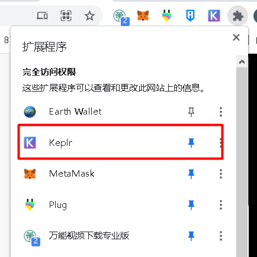
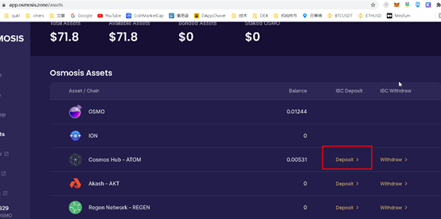
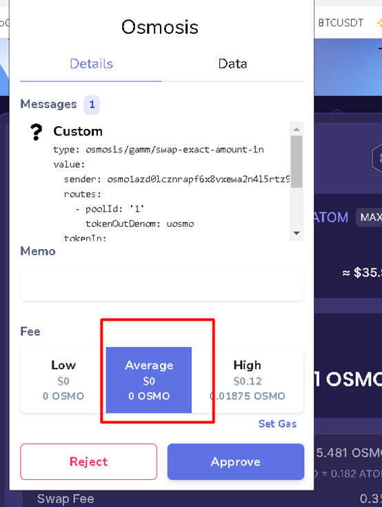
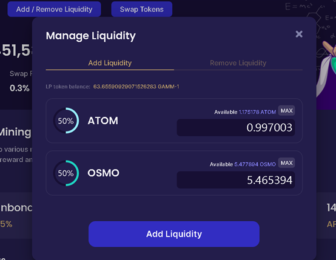
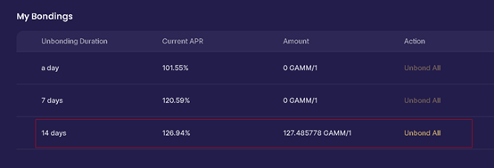

## ATOM-osmosis-LP操作说明

来自推特大佬 十一地主 1pay_eth 感谢

1: 下载钱包插件，地址是：https://chrome.google.com/webstore/detail/keplr/dmkamcknogkgcdfhhbddcghachkejeap
你需要用电脑翻墙才能安装，用chrome浏览器

2:  浏览器进入https://app.osmosis.zone，链接钱包

3: https://app.osmosis.zone/assets 在这里Cosmos Hub - ATOM的deposit，充值atom

4: 用充值的atom，在https://app.osmosis.zone兑换其他币，比如OSMO

5: 然后做一下ATOM/OSMO的LP，在里面质押久一些，就当这些钱不要了。

### **下面是操作说明**

1.  **安装插件**

 

2. **显示插件**

 
3. **充值**

 

 

 
   cosmos 网络的速度还是很快的

4. **交易**

 
 

 

5. **增加流动性**

 

 

 
6. **添加到LP中**

 

 

 
---------------------------over-------------------------------
