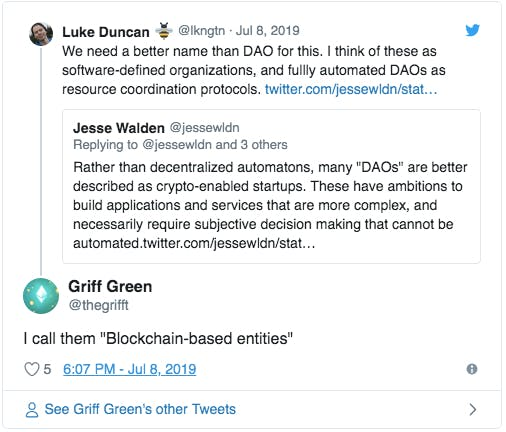

**104定义DAO**

原文：https://hackernoon.com/what-is-a-dao-c7e84aa1bd69?continueFlag=5fa6beb099367406036b7744fdf0d518

翻译：Machine

排版：来自推特：PING @yux0829

**DAO的春天**

自从2016年The DAO倒下后，去中心化的自治组织就游离于聚光灯下。然而，这一领域的发展和实验从未停止。在2019年，对DAO的支持一直在增加势头，这一点从以下方面可以看出。

1.   在主网上创建DAO的三个主要系统的可用性。Aragon, DAOstack, Colony

2.   继Maker之后，用DAO管理加密协议的新举措。KyberDAO (Kyber Networks), PolkaDAO (Polkadot), dxDAO (Gnosis)

3.   为DAO建立管辖区，要么是分散的管辖区（Kleros、Aragon法院），要么是为DAO提供法律工具的传统领土（佛蒙特州、马耳他、联合王国等）。

但也许最强烈的信号是，我们看到DAO的出现已经进入了 "非加密货币 "世界。例如，总部位于英国的Nexus Mutual是第一个以合作社形式成立并由DAO驱动的去中心化互助保险。诚然，他们发行的保单现在只为智能合约提供保险，但该项目旨在为其他类型的风险提供保险，这些风险通常由传统的保险公司承保。

在法国，La Suite du Monde也计划使用DAO来管理其资金和倡议。这个项目似乎与加密货币世界的城市和虚拟特征相距甚远。它的目的是为 "想象中的公社 "提供土地以及金融和法律支持，在我们的工业文明可能崩溃的情况下，这些公社是当地的、有弹性的、独立的、自我组织的合作社。

从布拉格到库拉索岛，从雅典到纽约，新的DAO到处出现。所有这些项目都有相同的发现和实验精神，都希望创造更公平的系统，都有作为以太坊和无许可公共区块链基础的去中心化的精神。然而，它们的目标和运作模式却非常不同。这就是为什么澄清DAO的实际含义可能被证明是有用的。

**什么是DAO？**

DAO代表的是 "去中心化的自治组织"。这些词中的每一个都可以有多种解释，催生出强调某一方面的DAO的不同定义。为了澄清这一概念，让我们分析一下每个术语。

**"自主性"**

DAO的基本特征是它们的运行规则是程序化的，这意味着当软件中规定的条件得到满足时，它们会自动应用和执行。这使它们有别于传统的组织，后者的规则形成了必须有人解释和应用的准则。

例如，设想一个组织的成员希望通过一个专家委员会向各种项目分配资金。在传统组织的情况下，一旦专家提出意见，员工必须进行许多步骤才能发放资金，从起草委员会的会议记录到向银行发送汇款指令。

在DAO的情况下，由于委员会的批准，资金会立即转移。没有什么可以阻止它，无论是内部利益相关者还是第三方，如银行甚至是公共机构。

为了使操作规则的自动和安全执行有效，它们必须在公共的、无权限的区块链上运行，如以太坊。这有两个主要原因。

1.   传统的软件不能直接处理资金。它只能向负责资金流动的金融中介机构传送命令。使用公共区块链使得将（加密）货币或其他（加密）资产置于DAO的直接和独特的控制之下成为可能，DAO是组织及其运作规则的软件代表。

2.   传统的软件依赖于由第三方运营的基础设施。如果规则是在AWS这样的云上或公司的某个服务器上运行的应用程序中编程的，那么它们的执行就取决于云运营商或IT部门，这些部门很容易受到中断、错误和外部影响的影响。

DAO是自主的，因为它的规则是自我强制的。没有人可以阻止它，也没有人可以从外部改变它。

**"非集中化"**

去中心化的方面可以从两个不同的角度来理解，这也说明了DAO的定义的冲突。

1.DAO是去中心化的，因为它运行在一个去中心化的基础设施上，即一个公共的、无许可的区块链，不能被国家或另一方所接管。

这一定义呼应了上文所述的自治概念。例如，Yalda Mousavinia将DAO定义为 "一个在数字管辖区运行的公司"。没有说到该公司是如何被治理的。

同样，Tim Bansemer指出，"DAO是在底层无权限区块链（如以太坊）上运行的智能合约的组成，形成一个组织基础设施"。同样，没有说到组织内的权力是如何分配的。

2.DAO是去中心化的，因为它没有围绕高管或股东进行分级组织，也没有围绕他们集中权力。

相反，Matan Field认为，DAO必然依赖于分布式治理系统，这意味着组织内权力的行使是集体的。COALA智囊团将DAO的权力结构描述为 "异质结构"，也就是说，基于没有从属关系的合作机制。

根据这一观点，DAO的新颖性恰恰在于它们能够协调非常多的人，同时避免了等级结构的繁琐。这一特点使它们在根本上区别于传统的组织。

这两种观点成为围绕DAO的主导性叙述。第一种可以称为 "为自由而战"，Aragon的同名宣传视频完美地捕捉到了这一点。DAOstack自己的视频漂亮地传达了第二种说法，可称为 "合作的未来"。

最后，如果考虑到DAO的基本特征是其逃避第三方扣押的能力，无论是外部（自治）还是内部（去中心化），这两种观点可以被看作是互补的。

**"组织"**

第一个声称自己是这样的DAO是 "The DAO"，创建于2016年，为有助于以太坊发展的项目提供资金。使用DAO而不是基金会或风险资本的想法与以太坊社区所珍视的去中心化精神相一致。事实上，DAO是一个投资基金，其决策由投资者直接作出，而不是委托给专门的管理人员。

DAO的概念早先由Dan Larimer提出，他在2013年创造了 "DAC "一词--非中心化自治公司。丹-拉里默将比特币比作一家公司，其股东是比特币持有人，其雇员是矿工。

同年，维塔利克-布特林(Vitalik Buterin)通过想象一个公司如何在没有管理人员的情况下开展工作，将这一想法泛化。商业自动化通常被看作是用机器人或计算机取代低技能人员的过程，让更多合格的员工保持控制。然而，维塔利克提出了相反的建议，也就是说，用一种能够招聘和支付人员的软件技术来取代管理，以完成有助于公司使命的任务。

这样的软件技术甚至可以向云服务提供商付费，让其拥有可以运行的计算机，从而独立于任何特定的基础设施。当然，确保这种技术不被第三方窃取资源或破坏是至关重要的，因此，使其自主和分散的理由。

**从组织到有机体**

"DAO "显然指定了比 "组织 "的典型定义更广泛的东西--一个将人们聚集在一起并为一个共同目的而工作的社会团体。维塔利克因此将DAO定义为 "一个生活在互联网上并自主存在的实体，但也严重依赖雇佣个人来执行某些自动机本身无法完成的任务。" 理查德-伯顿说得更清楚。"DAO是生活在以太坊上的数字系统的一种华丽的说法。"

从本质上讲，我们谈论的是一个履行组织职能的实体，它具有与该术语很少相关的外观。

**一个区块链**

Tezos是一个公共区块链，它将自身修改所需的操作整合在其协议中，从而使其具有自适应性。这些修改是由区块链原生代币的持有者根据Tezos代码控制的程序提出和投票的，其本身也可根据同样的程序进行修改。
Dash是一个公共区块链，其代码将部分区块奖励（通常用于支付验证交易的工作的财务奖励）分配给由网络成员管理的预算，以资助技术发展和对项目有用的推广行动。

**一个生态系统**

Aragon网络通过提供一个运行DAO的平台、它们可以配备的应用程序（代币化预算管理、投票、筹款等）以及解决它们之间冲突的去中心化管辖权（Aragon法院）来支持创建数百个DAO。
La Suite du Monde是一个社区主义运动，通过购买农业用地，提供法律、治理、技术和会计资源，以及产生一个联盟网络，支持创建当地的自组织社区。

**一件艺术作品**

Plantoid是一个电子机械装置，它模拟了植物的外观。它可以自我维持，甚至可以通过与作为赞助人和艺术家与它互动的人类合作而自我繁殖。

**互助保险**

Nexus Mutual是一个合作社，为其成员提供互助保险的服务，不需要公司来处理行政工作。保费管理和索赔处理通过智能合约自动进行，直接协调与投保人之间的互动。

**自然资源**

Terra0的目的是增强森林的能力，其经济生产（销售木材）使其能够支付对那些资助最初土地收购的人的债务。一旦这笔债务得到清偿，森林就可以利用其资源购买更多的土地来扩大规模。

**软件**

口袋网络是一个应用程序接口（API），允许通过一个去中心化的网络访问公共区块链。它的DAO将使有关代码的演变和程序的融资的决策权转移到社区（开发者和网络节点运营商）。
Pando Network是一个版本控制系统（VCS），它将通过提供贡献跟踪、信誉管理和治理等服务，把每个代码库（包括Pando的仓库本身）变成一个DAO。

**协议书**

MakerDAO是一个创建合成稳定币（DAI）的协议，其参数由网络治理代币（MKR）的持有人控制。
dxDAO是一个管理DutchX的DAO，DutchX是以太坊上的一个去中心化的交易协议。与MakerDAO一样，社区可以决定DutchX协议如何发展。此外，社区还可以引入全新的机制，以创建支持整个去中心化金融的协议基础设施。
让我们暂时忘掉 "组织 "一词通常给人带来的私人公司或公共行政部门的印象。像任何组织一样，DAO是协调人类活动的工具。

 

除了纯粹的多样性之外，它们还显示出一个关键的类似特征：能够促进对共同物品的集体管理，包括文化和非物质作品、自然资源、经济和工业生产以及社会制度。